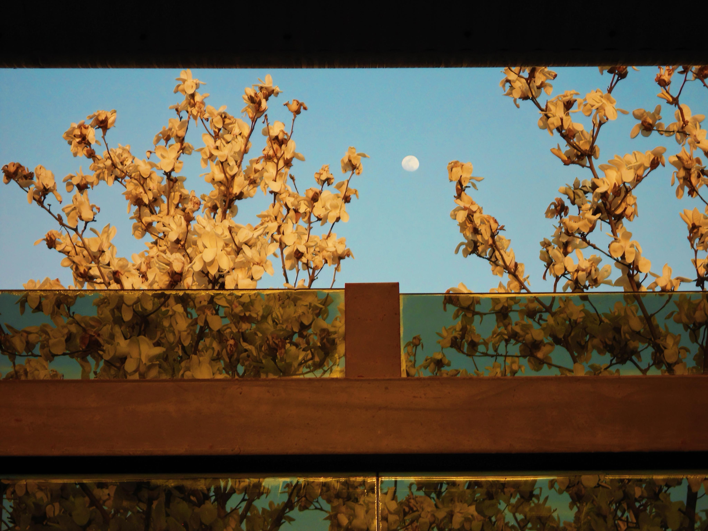

# **Welcome to CYYZ!**

- *[CYYZ](https://baike.baidu.com/item/%E9%9D%92%E5%B2%9B%E5%B8%82%E5%9F%8E%E9%98%B3%E7%AC%AC%E4%B8%80%E9%AB%98%E7%BA%A7%E4%B8%AD%E5%AD%A6/62625261)是啥？

        Nobody Cares.

- 关于CYYZ-wiki

    **一份兴趣使然的结果。**

    一个无厘头的念头，一名有想法的学生，一群陪伴的好友，一次压抑下的释放。

    无论什么，总之，这一切汇聚到了这里。

# **目录**

点击可快速跳转。

- [1. 前言](intro/Pre-saying.md)
- [2. 鸣谢](intro/thanks.md)
- [3. 食堂](dish/index.md)
    - [3.1 特色区](dish/special/menu.md)
    - [3.2 营养餐](dish/diningarea.md)
    - [3.3 杂类](dish/others.md) 
    - [3.4. 心声](dish/comments.md)
        - [3.4.1 学生反馈](dish/comments.md#学生反馈)
        - [3.4.2 教师评价](dish/comments.md#教师评价)
        - [3.4.3 食堂回馈](dish/comments.md#食堂回馈)
        - [3.4.4 校长留言](dish/comments.md#校长留言)
- [4. 校园](campus/index.md)
    - [4.1 教学楼](campus/teaching-building.md)
    - [4.2 操场](campus/playground.md)
    - [4.3 食堂](campus/dinninghall.md)
    - [4.4 天问楼](campus/Tianwen-building.md)
    - [4.5 学术报告厅](campus/hall.md)
    - [4.6 宿舍](campus/dorm.md)
